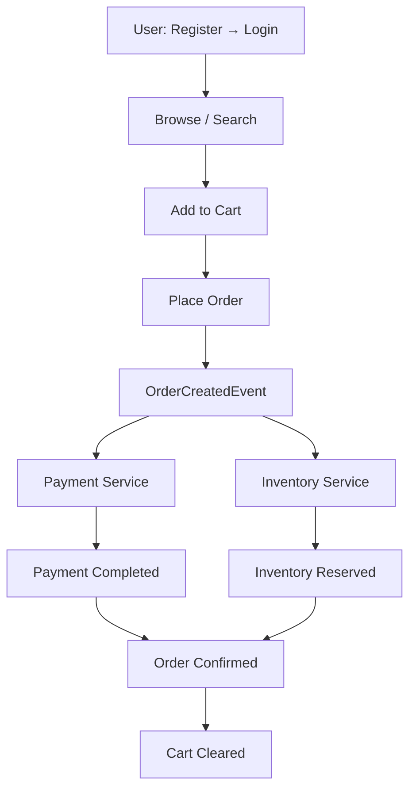

# 🛒 E-Commerce Microservices System

<p align="center">
  <b>Scalable • Event-Driven • Distributed • Production-Grade</b>
</p>

## 📌 Overview

A scalable, production-grade microservices architecture built with Spring Boot and event-driven communication for distributed transaction handling.

Designed to model how real-world e-commerce platforms manage high-throughput traffic, fault tolerance, and eventual consistency in a distributed environment.

---

## 🏗️ Architecture Overview

> This architecture reflects how large-scale distributed systems operate in production.

## ⚙️ Core Architectural Principles

- **Microservices Architecture** (database-per-service pattern)  
- **Event-Driven Communication** via Apache Kafka  
- **Distributed Transactions** using Saga (Choreography)  
- **Service Discovery** with Netflix Eureka  
- **API Gateway** for centralized routing & security  
- **JWT-based Authentication & Authorization**  
- **Search Service** powered by Elasticsearch with Redis support  
- **Hybrid Communication** (Async via Kafka + Sync REST where required)  

---
## 🛠 Architecture & Tech Stack
This project is a distributed, event-driven e-commerce backend system built using:

### 🏗 Architectural Style
- Microservices Architecture  
- Event-Driven Architecture  

### 🚀 Core Technologies
- Spring Boot  
- Apache Kafka  
- MySQL  
- Redis  
- Elasticsearch  
- JPA / Hibernate  
- OpenFeign  

### 🔁 Distributed System Patterns
- Saga Pattern (Orchestration)  
- Outbox Pattern  
- Inbox Pattern  
- Idempotent Processing  


---

## 🎯 What This Project Actually Solves

This is **not just an order system** — it addresses real-world distributed system challenges:

- ✔ Distributed transaction management  
- ✔ Event-driven consistency  
- ✔ Idempotent processing  
- ✔ Reliable event publishing  
- ✔ Duplicate message handling  
- ✔ Order orchestration  
- ✔ Data integrity across services  
- ✔ Eventually consistent architecture
- ✔ Fault tolerance with Resilience4j (Circuit Breaker, Retry, Rate Limiter)

---

## 🧩 Services & Responsibilities

- **API Gateway** → Centralized request routing  
- **Auth Service** → JWT authentication management  
- **Cart Service** → User cart management  
- **Config Server** → Centralized configuration management  
- **Inventory Service** → Stock reservation handling  
- **Order Service** → Order lifecycle orchestration  
- **Payment Service** → Payment transaction processing  
- **Product Service** → Product catalog management  
- **Profile Service** → User profile management  
- **Search Service** → Product search indexing  
- **Server Registry** → Service discovery management  

---

# 🌐 Service Ports

| Service | Port |
|----------|------|
| API Gateway | 8080 |
| Eureka Server | 8761 |
| Config Server | 8888 |
| Auth Service | 9001 |
| Product Service | 9002 |
| Cart Service | 9003 |
| Inventory Service | 9004 |
| Payment Service | 9006 |
| Profile Service | 9007 |
| Search Service | 9008 |
| Order Service | 9096 |
| Kafka | 9092 |

---

# 🚀 Getting Started


Before running the system, make sure you complete the following setup.

---

# 0️⃣ Config Server Repository Setup (IMPORTANT)

This project uses a centralized configuration repository.

The Config Server fetches configuration from this Git repository:

https://github.com/rajni2209/e-commerce_config_server

## 🔹 What You Need To Do

1. Fork or clone the repository:

```bash
git clone https://github.com/rajni2209/e-commerce_config_server.git
```

2. Create your own GitHub repository.
3. Push this config project to your own repository.
4. Update the `spring.cloud.config.server.git.uri` property
   inside your Config Server `application.yml` to point to your repo.

Example:

```yaml
spring:
  cloud:
    config:
      server:
        git:
          uri: https://github.com/your-username/your-config-repo
```

⚠️ Make sure this is configured before starting microservices.

---


## 1️⃣ Start Infrastructure (Manual Setup)

This project does NOT use Docker.

Make sure the following services are installed and running locally before starting the microservices.

---

### 📨 Kafka

Start Kafka broker:

```bash
kafka-server-start.sh config/server.properties
```

Default:
```
localhost:9092
```

---

### 🧠 Redis

Start Redis server:

```bash
redis-server
```

Verify Redis is running:

```bash
redis-cli ping
```

Expected response:

```
PONG
```

Default:
```
localhost:6379
```

---

### 🗄️ MySQL
The following databases must already exist:

- e_commerce                → Auth Service
- e_commerce_productservice → Product Service
- e_commerce_orderservice   → Order Service
- e_commerce_paymentservice → Payment Service
- e_commerce_inventoryservice → Inventory Service
- e_commerce_profile        → Profile Service

If needed, create them manually:

```sql
CREATE DATABASE e_commerce;
CREATE DATABASE e_commerce_productservice;
CREATE DATABASE e_commerce_orderservice;
CREATE DATABASE e_commerce_paymentservice;
CREATE DATABASE e_commerce_inventoryservice;
CREATE DATABASE e_commerce_profile;
```

Default MySQL Port:
```
3306
```

Update your credentials according to your local MySQL setup.

```yaml
spring:
  datasource:
    url: jdbc:mysql://localhost:3306/<your_database_name>?useSSL=false&serverTimezone=UTC&allowPublicKeyRetrieval=true
    username: <your_mysql_username>
    password: <your_mysql_password>
    driver-class-name: com.mysql.cj.jdbc.Driver
```
⚠️ Replace:

- `<your_database_name>` with the appropriate service database
- `<your_mysql_username>` with your MySQL username
- `<your_mysql_password>` with your MySQL password

---

## 2️⃣ Start Services (Order Matters)

1. Config Server (8888)
2. Eureka Server (8761)
3. API Gateway (8080)
4. All Microservices

```bash
mvn clean install
mvn spring-boot:run
```

---


# 🔥 Complete System Flow



---

# 🔐 Authentication Flow

## STEP 1 — Register

POST http://localhost:8080/auth/register

```json
{
  "username": "rajni",
  "email": "rajni@gmail.com",
  "password": "Password@123"
}
```

✔ Password encoded with BCrypt  
✔ User stored in MySQL  

---

## STEP 2 — Login

POST http://localhost:8080/auth/login

```json
{
  "email": "rajni@gmail.com",
  "password": "Password@123"
}
```

Response:

```json
{
  "token": "eyJhbGciOiJIUzI1NiIsInR5cCI6IkpXVCJ9..."
}
```

Include this header in all protected requests:

```
Authorization: Bearer <token>
```

---

# 🛍️ User Journey

## STEP 3 — Browse Products

GET http://localhost:8080/products

Returns product list from Product Service.

---

## STEP 4 — Search Products

GET http://localhost:8080/search?keyword=laptop

Search Service handles query.

---

## STEP 5 — Add to Cart

POST http://localhost:8080/cart/add

```json
{
  "productId": 1,
  "quantity": 2
}
```

Cart stored in Redis:

Key:
```
cart:userId
```

Stored format:

```json
{
  "items": [
    {
      "productId": 1,
      "quantity": 2
    }
  ]
}
```

---

## STEP 6 — Place Order

POST http://localhost:8080/orders

```json
{
  "items": [
    {
      "productId": 1,
      "quantity": 2
    }
  ]
}
```

---

# 🔄 Distributed Saga Flow

## Order Service

- Creates order
- Sets:
  - paymentCompleted = false
  - inventoryReserved = false
  - status = CREATED
- Saves to database
- Stores event in Outbox
- Publishes OrderCreatedEvent

---

## Kafka Event Example

Topic: order-events

```json
{
  "eventId": "uuid",
  "eventType": "OrderCreatedEvent",
  "aggregatedId": 12,
  "payload": {
    "orderId": 12,
    "items": [...]
  }
}
```

---

# 💳 Payment Service

Consumes OrderCreatedEvent

- Idempotency check
- Creates payment record
- Publishes PaymentCompletedEvent

Topic: payment-events

---

# 📦 Inventory Service

Consumes OrderCreatedEvent

- Checks stock
- Deducts quantity
- Publishes InventoryReservedEvent

Topic: inventory-reserved-events

---

# 🧱 Reliability Layer

| Feature | Implemented In |
|----------|----------------|
| Saga Pattern | Order Service |
| Outbox Pattern | Order, Payment, Inventory |
| Inbox Pattern | Order, Payment, Inventory |
| Idempotency | Payment |
| Kafka acks=all | Producer |
| enable-idempotence=true | Producer |
| Resilience4j | Circuit Breaker, Retry |
| Redis | Cart Storage |

---


